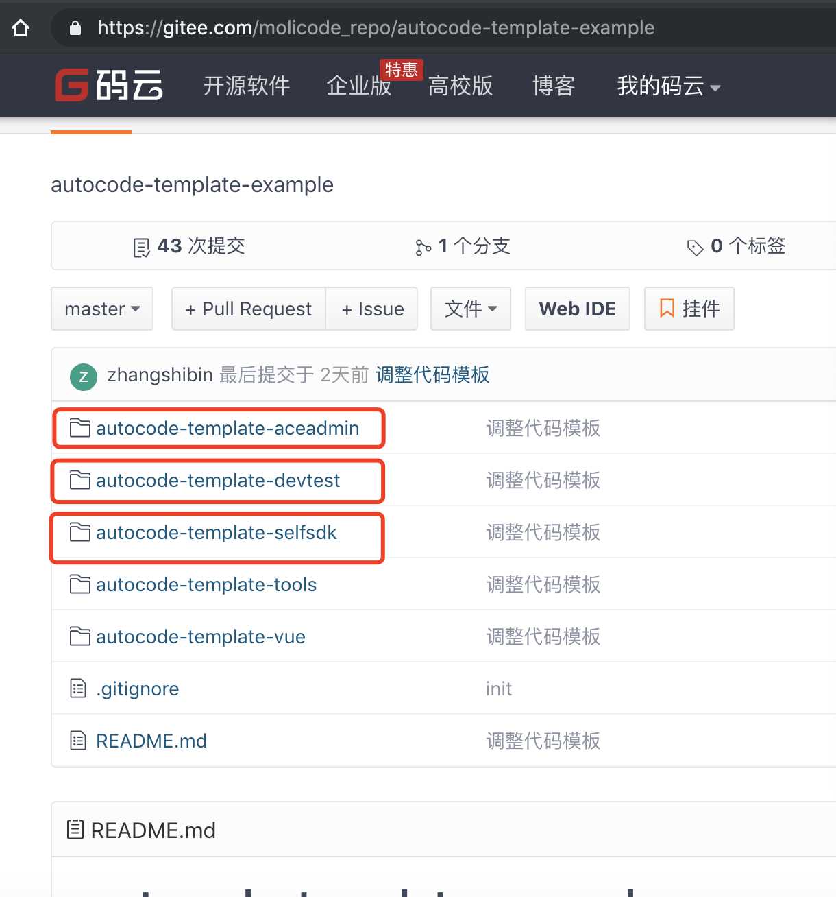

# chapter01 模板开发基础篇

## 模板资源存储
我们所有的模板资源，建议托管到git仓库里面，方便大家发布和更新资源。如果是公开的可以推送到public仓库，如果公司内部私有的可以推送到私有仓库。

一个git仓库可以只存储一个模板集合，也可以存储多个：

存储单个的工程实例：https://gitee.com/molicode_repo/molicode-template-elementui

存储多个的工程实例：https://gitee.com/molicode_repo/autocode-template-example

多个的git仓库如下图所示，每个子文件下存储一个模板集合，每个子文件夹下面都有：

## 模板文件夹说明

autoCode.xml  描述整个模板的信息；

模板目前支持： groovy template（推荐）、velocity 、xlsx

后期可扩展：freemarker, thymeleaf等；

请访问以下地址，查看帮助文档： https://cn2oo8.github.io/molicode_doc

## 模板中可直接使用的数据和工具

### 内置预处理数据结构
* key: data  指向：前台输入按数据模型处理后的结果； 说明：原始数据；
* key: config 指向：com.shareyi.molicode.common.vo.code.ConfigVo  说明：来自于
* key: tableModel 指向：com.shareyi.molicode.common.vo.code.TableModelVo  说明：来自于数据库表模型，可以参考安装目录下：tableModel文件夹生成的json数据结构取值；
* key: tableDefine 指向：com.shareyi.molicode.common.vo.code.TableDefineVo  说明：来自于数据库表模型 , 和tableModel.tableDefine 同为一个对象，可以参考安装目录下：tableModel文件夹生成的tableDefine数据结构取值；

### 本工程提供的工具类
* key: tableNameUtil  指向：com.shareyi.molicode.common.utils.TableNameUtil； 说明：
* key: PubUtils 指向：com.shareyi.molicode.common.utils.PubUtils  说明：
* key: snippetTemplateUtil, dictUtil  指向：com.shareyi.molicode.common.utils.SnippetTemplateUtil  说明：模板片段工具类，用于字典项转换等处理；

第三方工具类：

* key: StringUtils   指向：org.apache.commons.lang3.StringUtils   说明：参考apache-commons 相关API说明；
  
* key: CollectionUtils  指向：org.apache.commons.collections4.CollectionUtils 说明：参考apache-commons 相关API说明；
  
*  key: JSON  指向：com.alibaba.fastjson.JSON 说明：参考fastjson相关API说明；

### 预留扩展的插槽
*  key: customTool   类型：HashMap  说明：可以通过groovy脚本，在customTool中设置自定义工具类，然后即可在其他地方通过： customTool['myTool'](paramter) 进行参数调用；

*   key: customData   类型：HashMap  说明：可以通过groovy脚本，在customData中设置自定义数据，然后即可在其他地方通过： customTool['customData'] 获取到该数据；

*  key: jsonConfig   类型：JsonObject 说明：数据来自项目的json扩展配置信息；  通过jsonConfig['myKey'] 可以取到jsonConfig中的值；

