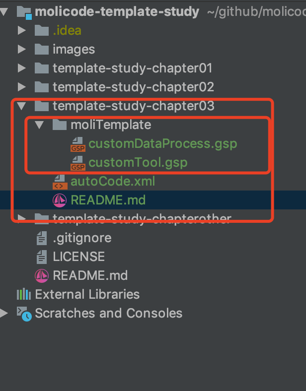

# 自定义数据处理和工具
## 使用场景
在我们日常模板开发过程中，魔力Code工具虽然本身已经很有魔力，但是依然无法满足千人千面的需求。我们常常需要进行自定义的数据处理，自定义的工具类提供。而这两个需求我们都是原生支持的。


## 加载顺序

自定义工具& 数据处理 这两个是按顺序加载的。因为我们考虑到自定义处理数据可能会用到自定义的工具，所以自定义工具会先加载，然后在进行自定义数据处理。

自定义工具加载-->自定义数据处理；

**特别说明：**

> 当然在以上两个自定义处理执行前，我们的数据模型已经按照您的配置信息预先加载到内存以及脚本上下文，您已经可以直接引用了。


## 配置入口

按约定优于配置的设计模式，我们约定，在autoCode.xml所处的根目录下：

* 自定义工具：moliTemplate/customTool.gsp 存储在这个文件中；
* 自定义数据：moliTemplate/customDataProcess.gsp 存储在这个文件中；

如图所示：




## 自定义工具说明

相对路径，在autoCode.xml 根目录下的：moliTemplate/customTool.gsp 文件中存储。

为普通的groovy template模板，我们可以使用groovy的闭包进行工具声明，然后通过预留的扩展插口：customTool['toolKey'] = 闭包对象引用； 回设到全局处理上下文之中，如下图所示：

```groovy
<%
    /**
     * 声明一个sayHello的闭包，类似js的function；
     */
    def sayHello = { userName, helloMsg ->
            return """${userName} say: ${helloMsg}! """
    }

    /**
     * 将改闭包，设置到customTool map对象之中；
     */
    customTool['sayHello'] = sayHello;
%>
```

## 自定义数据处理说明

相对路径，在autoCode.xml 根目录下的：moliTemplate/customDataProcess.gsp 文件中存储。

为普通的groovy template模板，我们可以通过预留的扩展插口：customData['dataKey'] = 自定义数据； 回设到全局处理上下文之中，如下图所示：

```groovy
<%
    /**
     * 引用在customTool中声明的 打招呼工具；
     */
    def sayHello = customTool['sayHello']

    /**
     * 将经过处理的数据设置到：customData map对象中；
     * 即可全局上下文直接获取；
     */
    customData['myData01'] = "my first custom data value";
    customData['helloInfo'] = sayHello("David", "welcome to moliCode!");

%>
```


## 我们在模板中如何使用

新建一个模板 custom